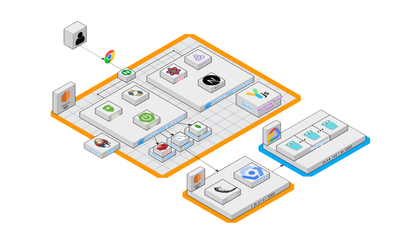
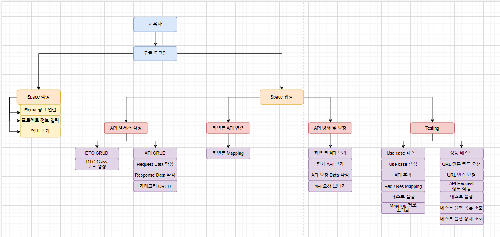
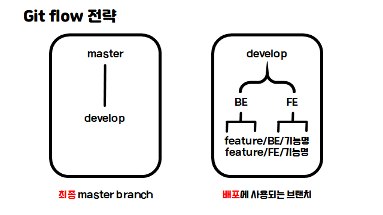
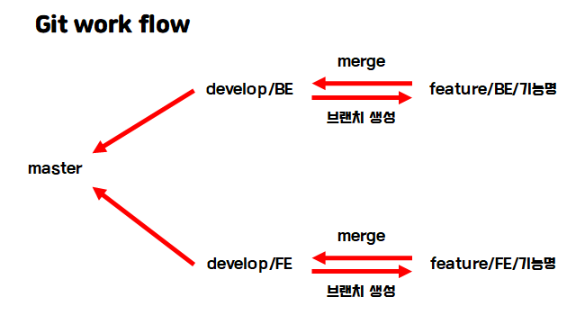
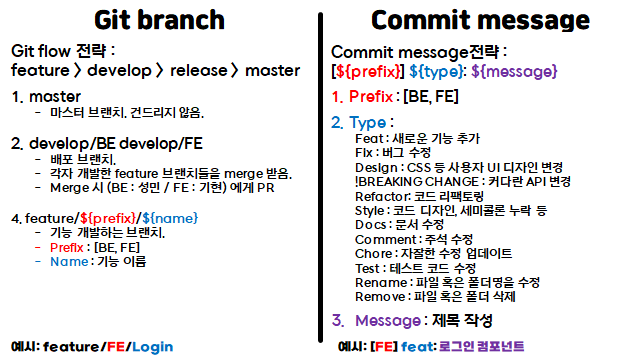

<div align="center">
  
</div>

<br/>

# SSAFAST Project

<br>

## 👪 개발 멤버 소개

<table> <tr> <td height="140px" align="center"> <a href="https://github.com/dolpongg">  <br><br> 👑 이수련 <br>(Back-End) </a> <br></td> <td height="140px" align="center"> <a href="https://github.com/xswaqz">  <br><br> 😆 민초현 <br>(Back-End) </a> <br></td> <td height="140px" align="center"> <a href="https://github.com/mickeyshoes">  <br><br> 😶 임성민 <br>(Back-End) </a> <br></td> <td height="140px" align="center"> <a href="https://github.com/YongjaeKwon">  <br><br> 🙄 권용재 <br>(Front-End) </a> <br></td> <td height="140px" align="center"> <a href="https://github.com/moxnox63">  <br><br> 😁 장엄지 <br>(Front-End) </a> <br></td> <td height="140px" align="center"> <a href="https://github.com/HanKyeon">  <br><br> 🙂 한기현 <br>(Front-End) </a> <br></td> </tr> 
<tr> <td align="center">OverloadTest<br/>Workspace<br/>Figma<br/>APISpec<br/>GCP<br/>GCP SDK<br/>Spring Boot<br/>JPA<br/>MySQL<br/>Redis<br/>
<td align="center">CI/CD<br/>UsecaseTest<br/>APIExec<br/>Auth<br/>Member<br/>JavaPoet<br/>SpringSecurity<br/>Spring Boot<br/>JPA<br/>MySQL<br/>MongoDB<br/>Redis</td> 
<td align="center">APISpec<br/>DtoSpec<br/>Spring Boot<br/>JPA<br/>MySQL<br/>MongoDB</td>
<td align="center">UI/UX<br/>NextJS<br/>React<br/>ReactHookForm<br/>Typescript<br/>Redux<br/>Tailwind<br/></td>
<td align="center">UI/UX<br/>NextJS<br/>React<br/>Typescript<br/>Redux<br/>ReduxTookKit<br/>Tailwind<br/></td>
<td align="center">NextJS<br/>React<br/>Typescript<br/>ReactQuery<br/>Redux<br/>ReduxTookKit<br/>Tailwind<br/>FigmaAPI<br/>Y.JS<br/></td></tr> </table>

<br />

## 📆 프로젝트 기간

### 23.04.10. ~ 23.05.19

- 기획 및 설계 : 23.04.10 ~ 23.04.24
- 프로젝트 구현 : 23.04.24 ~ 23.05.18
- 버그 수정 및 산출물 정리 : 23.05.15 ~ 23.05.18

<br />

## 💡 서비스 소개

### SSAFAST

> 프로젝트 설계ㆍ테스트 단계에서의 더 높은 개발자 경험을 위한 오픈소스<br /><br />Figma, Notion, Postman, Swagger, Locust 등<br /> 수많은 개발 플랫폼의 이동을 최소화함으로써, 업무 집중력을 높입니다!<br /><br />개발자들이 프로젝트에 참여하며 느낄 수 있는 크고 작은 불편함을 해소하고자 하였습니다.

### 불편함을 해소하여 개발 속도를 더욱 빠르게, SSAFAST

<br/>

## 🛠️ 기술 스택

#### Front


#### Back

    <br/>     

#### CI/CD
  

#### 기타

  

#### 협업 툴

  

<details><summary> <b> 상세 기술스택 및 버전</b> </summary>

| 구분     | 기술스택                   | 상세내용                   | 버전      |
| -------- | -------------------------- | -------------------------- | --------- |
| 공통     | Gitlab                     | 형상관리                   | \-        |
|          | Jira                       | 이슈관리                   | \-        |
|          | Mattermost, Notion         | 커뮤니케이션               | \-        |
| BackEnd  | MySQL                      | DBMS                       | 8.0.21    |
|          | MongoDB                   |DBMS, DataBase               | 6.0.5     |
|          | Java                       | OpenJDK                    | 1.8.0_362 |
|          | Spring Boot                | Java Server Framework      | 2.7.6     |
|          | Spring Security            |                            | \-        |
|          | JPA                        |                            | \-        |
|          | IntelliJ                   | IDE                        | \-        |
|          | Java Poet                  | Code Generator             | 1.13.0     |
|          | OAuth2                     |                            | 2.6.2     |
|          | Vegeta                     | 부하테스트 오픈소스         | 8.0.0    |
|          | Redis                      | 인메모리 데이터베이스       | 7.0.11   |
|          | Gradle                     | Build                     | 7.6.1     |
| FrontEnd | Next.JS                    | 프론트 프레임워크         | 13.3.0        |
|          | React                      |                            | 18.0.35        |
|          | Typescript                 |                            | 5.0.4        |
|          | ReactQuery               | 서버 상태 관리 라이브러리       | 0.17.6    |
|          | React Hook Form         | 폼 관리 라이브러리          | 7.43.9     |
|          | Redux ToolKit                 | 상태 관리 라이브러리 | 1.9.3     |
|          | Tailwind                    | CSS 라이브러리     | 3.3.1       |
|          | axios                      | API 통신 라이브러리        | 1.2.3     |
|          | IDE                        | Visual Studio Code         | 1.75.1    |
| Server   | AWS EC2                    | Server                     | \-        |
|          | Nginx                      |                            | 1.23.3    |
|          | Docker                     |                            | 23.0.1    |
| Test     | test            | Postman              | 10.9.4            |
|          | test            | JUnit5               | \-                |
|          | test            | Mockito              | \-                |
|          | test            | Jacoco               | toolVersion 0.8.7 |

</details>

<br />

## 🗂️ 프로젝트 구성

시스템 아키텍처

---



---

서비스 흐름도

---



---

<details>
<summary>FE 폴더 구조</summary>

```Plain Text
├── components
│   ├── apis
│   ├── canvas
│   ├── common
│   ├── create
│   ├── forms
│   ├── preview
│   └── work
│       ├── APIConnectContainer
│       ├── APIDocsContainer
│       │   └── formComponent
│       ├── APIEditContainer
│       └── APITestContainer
│           └── usecase
├── hooks
│   └── queries
├── nginx
├── pages
│   ├── api
│   └── space
│       └── [spaceId]
├── public
│   └── assets
│       ├── fonts
│       └── images
├── store
├── styles
└── utils
```

</details>
<details>
<summary>BE 폴더 구조</summary>

```Plain Text
├── gradle
│   └── wrapper
└── src
    ├── main
    │   └── java
    │       └── com
    │           └── rocket
    │               └── ssafast
    │                   ├── apiexec
    │                   │   ├── controller
    │                   │   ├── domain
    │                   │   │   ├── document
    │                   │   │   │   └── element
    │                   │   │   └── entity
    │                   │   ├── dto
    │                   │   │   ├── request
    │                   │   │   │   └── element
    │                   │   │   └── response
    │                   │   ├── repository
    │                   │   └── service
    │                   ├── apispec
    │                   │   ├── controller
    │                   │   ├── domain
    │                   │   │   ├── Document
    │                   │   │   │   ├── element
    │                   │   │   │   └── temp
    │                   │   │   ├── Entity
    │                   │   │   └── Enum
    │                   │   ├── dto
    │                   │   │   ├── request
    │                   │   │   └── response
    │                   │   ├── repository
    │                   │   └── service
    │                   ├── auth
    │                   │   ├── controller
    │                   │   ├── domain
    │                   │   ├── dto
    │                   │   │   ├── request
    │                   │   │   └── response
    │                   │   ├── handler
    │                   │   ├── jwt
    │                   │   └── service
    │                   ├── config
    │                   ├── dtospec
    │                   │   ├── Enum
    │                   │   ├── controller
    │                   │   ├── domain
    │                   │   │   └── element
    │                   │   ├── dto
    │                   │   │   ├── request
    │                   │   │   └── response
    │                   │   ├── repository
    │                   │   └── service
    │                   ├── exception
    │                   ├── figma
    │                   │   ├── domain
    │                   │   ├── dto
    │                   │   │   ├── request
    │                   │   │   └── response
    │                   │   ├── repository
    │                   │   └── service
    │                   ├── member
    │                   │   ├── controller
    │                   │   ├── domain
    │                   │   ├── dto
    │                   │   │   └── response
    │                   │   ├── repository
    │                   │   └── service
    │                   ├── overload
    │                   │   ├── controller
    │                   │   ├── domain
    │                   │   ├── dto
    │                   │   │   ├── request
    │                   │   │   └── response
    │                   │   ├── repository
    │                   │   └── service
    │                   ├── tmp
    │                   │   ├── controller
    │                   │   ├── domain
    │                   │   ├── dto
    │                   │   ├── repository
    │                   │   └── service
    │                   ├── usecase
    │                   │   ├── controller
    │                   │   ├── domain
    │                   │   │   ├── document
    │                   │   │   │   └── element
    │                   │   │   │       ├── request
    │                   │   │   │       └── response
    │                   │   │   └── entity
    │                   │   ├── dto
    │                   │   │   ├── request
    │                   │   │   └── response
    │                   │   ├── repository
    │                   │   └── service
    │                   ├── utils
    │                   └── workspace
    │                       ├── controller
    │                       ├── domain
    │                       ├── dto
    │                       │   ├── request
    │                       │   └── response
    │                       ├── repository
    │                       └── service
    └── test
```

</details>

---

<br/>

## **🎨 Figma**

 

<br />

## 🗂 ERD

 </div>

<br />

## 🖥️ 주요기능

### 개요
- API 명세
	- 화면 별 UI 디자인을 보며 필요한 요청/응답 데이터를 확인하여 같은 공간에서 API 설계
		- API 명세 작성을 위해 Figma 화면과 명세 작성 문서를 번거롭게 이동해야하는 불편함 해소
		- Postman, Swagger와 달리 Request 값 제약조건의 제약조건과 Response 항목에 대한 주석 가능하게 함으로써 개발 과정의 오해를 최소화
	- 각 화면마다 필요한 API 목록 연결 가능
		- 프론트엔드 개발을 위해 화면별로 어떤 API가 필요한지 한눈에 확인 가능
  - code generator
- API 요청
	- 화면별로 연결된 API 목록을 한눈에 확인하고 같은 공간에서 요청 테스트를 진행함으로써, 해당 화면에 필요한 API들이 성공적으로 작동하는지 쉽게 확인 가능
	- API 요청에 대한 응답을 저장함으로써, 성공 응답과 실패 응답 그리고 그 응답을 보냈을 때의 요청값 정보를 확인 가능
- 유스케이스 테스트
	- 하나의 시나리오를 위해 실행되어야하는 API들의 데이터를 **유기적**으로 요청하여, 해당 기능이 성공적으로 구현되었는지 쉽게 확인
		- ex. 댓글 작성 유스케이스 테스트
			1. 로그인 API 호출을 위해, 계정 정보를 입력
			2. 글 작성 API 호출을 위해, 제목과 내용을 입력하고 1번 API 응답 헤더의 Access Token를 2번 API 요청 헤더의 Authorization에 매핑
			3. 해당 글에 대한 댓글 작성 API 호출을 위해, 댓글 내용을 입력하고 2번 API 응답의 글 ID를 3번 API의 요청 바디의 글 id에 매핑
			4. 유스케이스 테스트 실행 버튼을 클릭하여, 위의 API들을 순차적으로 실행 마지막으로 호출된 API 응답을 확인
- 성능 테스트
	- 테스트하고자 하는 api, duration, 초당 request 수를 입력하면 동적으로 테스트 서버를 생성하여 성능테스트를 대리 수행함
    - GCP SDK를 이용하여 클라우드 서버 동적 생성
		- vegeta 오픈소스로 성능테스트 수행

<br />

### I. 워크스페이스 생성


---

- 1단계 : 팀에서 사용하고 있는 피그마 url을 입력하면 피그마 API를 이용해 피그마 정보를 불러옵니다.
- 2단계 : 프로젝트의 정보를 작성합니다. 이름, 설명, 기간 등을 입력하고, 팀원도 초대합니다.
- 3단계 : 팀에서 사용할 피그마 섹션 목록을 선택하고 워크스페이스 생성을 마무리합니다.

<br />

### II. 워크스페이스 홈화면

  

---

- 왼쪽 상단은 워크스페이스 생성시 작성한 프로젝트 정보입니다.
- 왼쪽 하단은 명세한 API 목록입니다.
- 오른쪽 상단은 전체 API 목록중 테스트가 완료된 API 갯수와 비율입니다.
- 오른쪽 하단은 팀원 목록입니다.

<br />

### III. DTO 명세 & API 명세


---

- 오른쪽에서 DTO 명세를 작성합니다. 필드의 이름과 타입, 제약조건까지 작성합니다.
- 등록한 DTO는 왼쪽에서 확인할 수 있습니다.
- 오른쪽 상단 DTO 코드 버튼을 누르면 명세한 정보를 바탕으로 생성된 DTO 클래스 코드를 받을 수 있습니다.


---

- 왼쪽은 피그마에서 작성한 섹션입니다. 피그마를 보며 오른쪽에서 API 명세를 작성할 수 있습니다.
- 명세에는 param, path variable, header, body 정보를 입력합니다.
- body에 객체 형태의 필드가 들어간다면 명세했던 DTO를 불러와 추가할 수 있습니다.

<br />

### IV. Figma 화면별 사용되는 API 연결


 
---

- 화면별로 사용될 API를 연결하는 단계입니다.
- 왼쪽 피그마 섹션중 하나를 골라 API 전체 목록중 사용할 API들을 선택해 저장합니다.

<br />

### V. API 요청 및 Axios 요청 객체 코드 반환


---

- 명세했던 정보를 바탕으로 요청을 보내는 단계입니다.
- 명세 정보를 확인하며 데이터를 삽입한 후 바로 요청을 보낼 수 있습니다.
- 요청한 정보를 바탕으로 Axios 요청 객체 코드를 받을 수 있습니다.

<br />

### VI. 유스케이스 테스트


---

- 유스케이스 검증에 필요한 API 목록을 선택합니다.
- API 명세를 바탕으로 적절한 데이터를 삽입합니다.
- 변수 관계 설정 : "Response 연결" 버튼을 눌러 오른쪽의 이전 응답 데이터 중 하나를 골라 변수 관계를 만들어줍니다.
- 유스케이스 성공시에는 마지막 API의 요청 결과가, 실패시에는 가장 마지막으로 요청된 API 요청 결과가 뜹니다.

<br />

### VII. 성능테스트


---
- 서버 소유 인증 : 상단의 코드 중 서버의 프레임워크와 일치하는 코드를 복사하여 서버에 붙입니다. 이때 요청을 받을 수 있는 경로가 "[server_url]/api/ssfast" 인지 꼭 확인해야합니다.
- 모든 서버에 대한 인증이 완료되어야 성능테스트를 이용할 수 있습니다.
- 테스트하고자 하는 API를 선택해서 데이터를 삽입하고 초당 요청 횟수, duration을 입력하고 요청합니다.

<br />


## 🎥 [UCC 보러가기](https://youtu.be/LxDlqr280do)

<br />

<div id="6"></div>

## 👥 협업 관리

### I. Git







<br />

### II. Notion

<a href="https://magical-sweatshirt-a0d.notion.site/93d9ef3bac7f448089c1096c304fad54" target="_blank">Link</a>

<br />